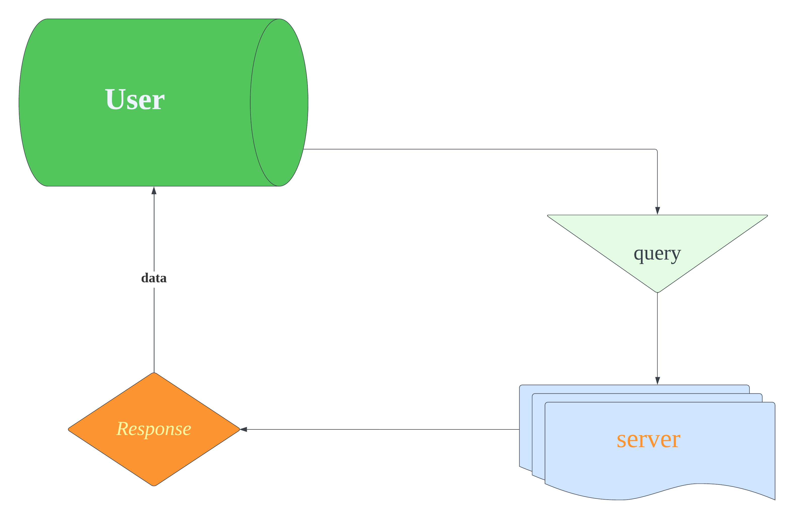
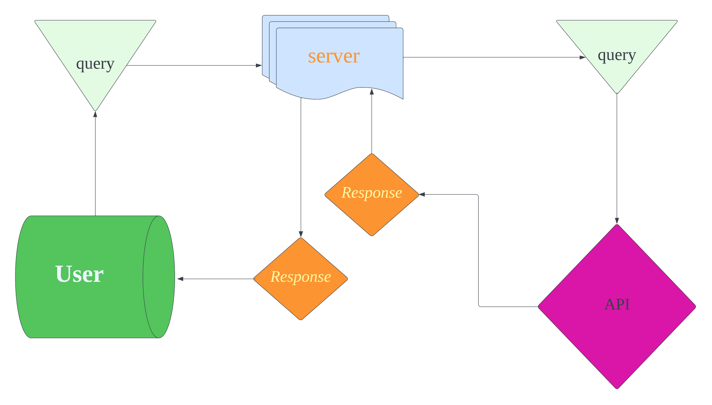

# City-Explorer-Api

**Author**: Roger Wells
**Version**: 1.0.0 (increment the patch/fix version number if you make more commits past your first submission)

## Overview

This project is designed to allow users to search for cities around the world and get location and weather data

## Getting Started

In order to build this app, a user must first create a server, set ports, then create a React framework to send queries and recive corresponding data

## Architecture

This app will be written using React, and styled in CSS. The server will be local, utilizing an API from a popular weather service. It is designed to be clear, concise, and easy to use

## Change Log
<!-- Use this area to document the iterative changes made to your application as each feature is successfully implemented. Use time stamps. Here's an example:

01-01-2001 4:59pm - Application now has a fully-functional express server, with a GET route for the location resource. -->

## Credit and Collaborations
<!-- Give credit (and a link) to other people or resources that helped you build this application. -->
Time Estimates
For each of the lab features, make an estimate of the time it will take you to complete the feature, and record your start and finish times for that feature:

## Name of feature: *Server*

Estimate of time needed to complete: 2 hours

Start time: 7:30 am

Finish time: 12 pm

Actual time needed to complete: 5 hours

## Name of feature: *Front End*

Estimate of time needed to complete: 1 hour

Start time: 12:30 pm

Finish time: had to finish other work...incomplete

Actual time needed to complete: 5 hours

**Version**: 1.0.2 (increment the patch/fix version number if you make more commits past your first submission)

## Name of feature: *API Request Implementation*

Estimate of time needed to complete: 1 hour

Start time: 7 am

Finish time: 2 pm

Actual time needed to complete: 5 hours

